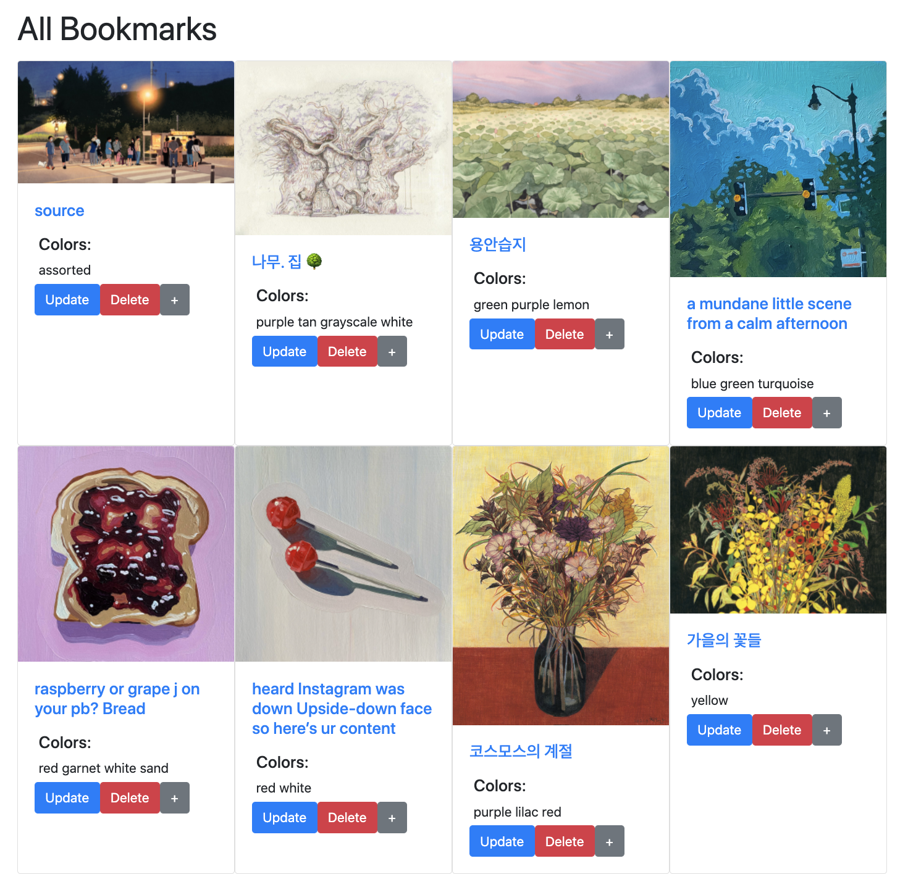

# referencefinder: a web app to save art references from twitter!
### Built with: A jQuery + Bootstrap frontend, Python + Flask server-side and Google Firebase (NoSQL) backend
###### Created during the Fall 2021 semester for Columbia University's Advanced Web Design Studio course  

